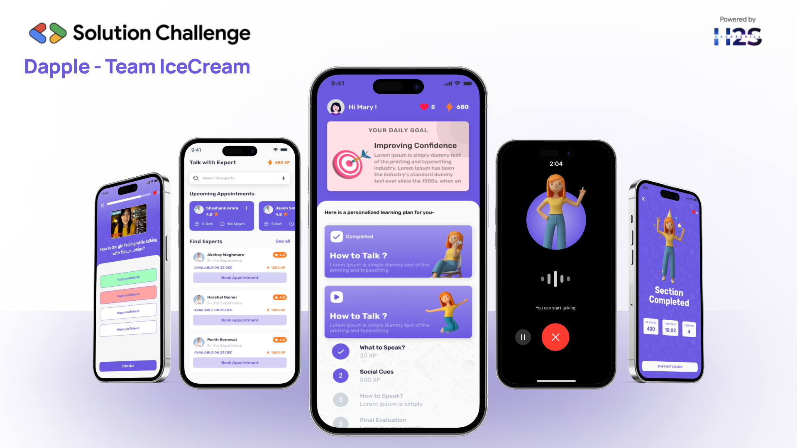

# Dapple Frontend

<div align="center">
	
	<h1>Dapple: one spot at a Time</h1>
	<h4>Dapple is an AI-powered mobile application designed to help neurodiverse individuals, particularly those with autism, improve their communication and social skills. This repository contains the Flutter-based frontend code for the Dapple platform.</h4>
</div>

## Features

- **Personalized Learning**: Dapple offers AI-driven modules that adapt to each user's unique learning style, strengths, and challenges. This personalization builds confidence and reduces frustration by allowing users to progress at their own pace in a structured, supportive environment.

- **Four-Section Learning Experience**:
  - 💬 **Section 1: Verbal Communication** - Interactive lessons and realistic prompts to teach appropriate responses in common social situations.
  - 👀 **Section 2: Non-Verbal Cues** - Exercises to recognize facial expressions, tone, and body language.
  - 🎤 **Section 3: Voice Practice** - Audio-based activities to improve clarity, tone, and pacing.
  - 🧠 **Section 4: Progress Evaluation** - Combined speaking and text-based tasks to apply learned skills in realistic settings.

- **AI-Powered Assessment**: Onboarding assessment analyzed by Gemini AI to build personalized learning paths.

- **Feedback System**: Voice and facial emotion recognition to provide deeply personalized feedback.

- **Expert Appointment System**: Book sessions with communication experts through an integrated calendar system that automatically generates Google Meet links for both parties.

- **AI Conversation Practice**: Practice conversations with AI that simulates different social roles (teacher, friend, colleague) to help users learn appropriate communication styles for various contexts.

## Tech Stack

- **Framework**: Flutter
- **Architecture**: Clean Architecture (Data-Domain-Presentation)
- **State Management**: Flutter Bloc / Cubit
- **Navigation**: Go Router
- **API Communication**: Http / WebSocket
- **Local Storage**: Shared Preferences
- **Authentication**: Firebase Auth / Google OAuth
  
## Getting Started

### Prerequisites

- Flutter 3.16.0 or higher
- Dart 3.0.0 or higher
- Android Studio / VS Code with Flutter extensions
- Firebase project (same as backend)
- iOS development setup (for Mac users)

### Installation

1. Clone the repository:
   ```bash
   git clone https://github.com/shashank-lol/dapple-frontend.git
   cd dapple-frontend
   ```

2. Install dependencies:
   ```bash
   flutter pub get
   ```

3. Configure environment variables:
   ```bash
   cp .env.example .env
   # Edit .env with your configuration
   ```

4. Run the app:
   ```bash
   flutter run
   ```

## Key UI Features

### Onboarding Assessment
- Smooth, intuitive onboarding process
- AI-analyzed questionnaire using Gemini
- Personalized learning path generation

### Level Structure
- Clearly organized level progression
- Progress tracking and visualization
- Achievement badges and rewards system

### Learning Sections
1. **Verbal Communication Section**
   - Interactive dialogue scenarios
   - Multiple-choice response training
   - Context-appropriate communication practice

2. **Non-Verbal Cues Section**
   - Facial expression recognition exercises
   - Body language interpretation activities
   - Tone of voice analysis

3. **Voice Practice Section**
   - Audio recording and playback interface
   - Voice clarity and pacing exercises
   - AI-based voice pattern analysis

4. **Progress Evaluation Section**
   - Combined skill assessment
   - Real-world scenario simulations
   - Detailed performance metrics

### Expert Appointment System
- Calendar integration with Google Calendar
- Expert profile browsing and selection
- View available appointment slots in real-time
- Book, reschedule, or cancel appointments
- View upcoming and past appointments
- Automatic Meet link generation and insertion in calendars
- Appointment reminders and notifications
- Session rating and feedback collection
- Expert specialization filtering

### AI Conversation Practice
- Role-based AI conversations (teacher, friend, colleague, etc.)
- Adaptive difficulty based on user progress
- Real-time feedback on communication style
- Conversation history and improvement tracking
- Multiple conversation scenarios for different social contexts

### Video Demo
<div align="center">



<p>See the complete video demo on Youtube</p>

</div>

## Development Guidelines

### Code Style
- Follow the official [Dart style guide](https://dart.dev/guides/language/effective-dart/style)
- Use named parameters for clarity
- Document public APIs with dartdoc comments

### State Management
- Use Flutter Bloc for complex state management
- Provider for simpler state requirements
- Keep presentation logic separate from business logic

### Testing
- Write unit tests for all use cases
- Create widget tests for UI components
- Maintain integration tests for critical user flows

## Backend Integration

This frontend connects to the [Dapple Backend](https://github.com/Harshal5167/Dapple-backend.git) which is built with Go. See the backend repository for API documentation and setup instructions.

## Contact

###Project Maintainers
- ([Shashank Arora](https://github.com/shashank-lol))
- ([Parth Revanwar](https://github.com/parthrevanwar))
